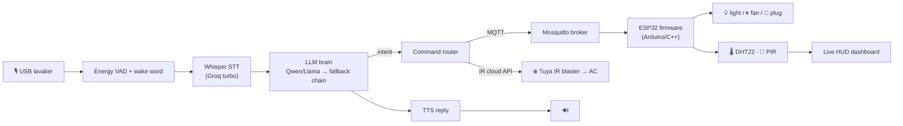

# NOVA — a self-hosted voice assistant that runs my room

*Networked Omni-room Voice Assistant*

A from-scratch, offline-first voice assistant that listens on a lavalier mic, understands natural language, and **physically controls my room** — lights, fan, AC, and live temperature/motion sensing — through an ESP32 I flashed myself. No Alexa, no cloud smart-home stack: a Mac hub, an MQTT broker, custom firmware, and an LLM brain I wired together.

> 🎥 **Demo:** `docs/demo.gif` — “Hey Nova, light up the room” → the relay clicks and the lamp turns on. *(add your 60-sec clip here)*

---

## What it does

- 🎙️ **Wake-word + continuous conversation** — say “Nova…”, then keep talking; it holds context and answers follow-ups without re-triggering.
- 🧠 **Understands intent, not just commands** — “set the room to 21” → sends the AC to 21°C; “it’s stuffy in here” → turns on the fan; “light up the room” → lights on.
- 🏠 **Real hardware control** — light / fan / plug relays via an ESP32, plus AC control through a Tuya IR blaster’s cloud API.
- 🌡️ **Live sensing** — DHT22 temperature + humidity and a PIR motion sensor stream to a dashboard and to the assistant, so it knows the room state.
- 🗣️ **Barge-in** — talk over it and it stops and listens, like a real conversation.
- 👤 **Owner face recognition** — recognises me on the webcam before acting on sensitive commands.
- ❤️ **Self-healing** — the ESP32 firmware reconnects Wi-Fi and reboots itself on failure; the assistant falls back across multiple LLMs if one rate-limits.

## Architecture



## Tech stack

| Layer | Tech |
|---|---|
| **Voice** | PyAudio (16 kHz), energy-based VAD, `noisereduce`, Whisper `large-v3-turbo` via Groq |
| **Brain** | Groq API (Qwen-3, Llama-3.3, GPT-OSS) with a 3-deep fallback chain + local Ollama backstop |
| **Speech out** | `edge-tts` streaming |
| **Vision** | InsightFace (owner recognition), MediaPipe (gesture volume) |
| **IoT** | ESP32 (Arduino/C++), Mosquitto MQTT, DHT22, PIR, opto-isolated relays |
| **AC** | Tuya IR Control Hub cloud API (`tinytuya`) |
| **Hub** | Python 3, async loops, a live HTML dashboard |

## How it works

**Voice pipeline.** Audio is captured in 1280-sample frames; an energy gate (calibrated to my own voice profile) opens recording, a wake-word regex confirms intent, then the clip is denoised and transcribed by Whisper. In conversation mode, follow-ups skip the wake word so it feels continuous. Barge-in closes the mic the instant I start talking over a reply.

**Brain + intent.** The transcript goes to an LLM with a room-aware system prompt. Deterministic intercepts catch home-control intents (“turn on the light”, “set temp to 21”) and fire the hardware action directly — fast and reliable — while everything else is answered by the model. If Groq rate-limits, it falls back down a chain of models rather than failing.

**IoT.** Commands publish to `home/room/{light,fan,plug}/set` on the MQTT broker. The ESP32 subscribes, switches the relays, and publishes temperature, humidity, and motion back. The firmware disables modem-sleep for low latency and self-heals: it re-associates Wi-Fi after repeated broker failures and reboots itself if it gets stuck.

## Hardware

- ESP32 dev board + opto-isolated relay module (light / fan / plug)
- DHT22 temperature/humidity sensor · HC-SR501 PIR motion sensor
- Tuya IR blaster (AC control) · USB lavalier mic

## Running it

```bash
pip install -r requirements.txt
# provide your own keys (see the .example files):
#   .groq_key  ·  ~/tinytuya.json  ·  iot/esp32_room/secrets.h
python3 doctor.py        # health check: deps, keys, mic, brain, MQTT, AC
python3 app/jarvis_app.py
```

Flash `iot/esp32_room/esp32_room.ino` to the ESP32 (Arduino IDE) after copying `secrets.h.example` → `secrets.h` and filling in your Wi-Fi + broker IP.

## Roadmap

- 🚗 **Voice-driven RC car** — same ESP32/MQTT pattern on a 4WD crawler (in progress)
- 📷 ESP32-CAM FPV + on-device vision offloaded to a Raspberry Pi
- 🧭 Autonomy / route-following

---

*Built solo, from firmware to LLM orchestration. The interesting parts: making a marginal built-in mic reliable for an accented voice, keeping latency low across a Wi-Fi mesh, and getting an LLM to act on intent deterministically instead of hallucinating device calls.*
